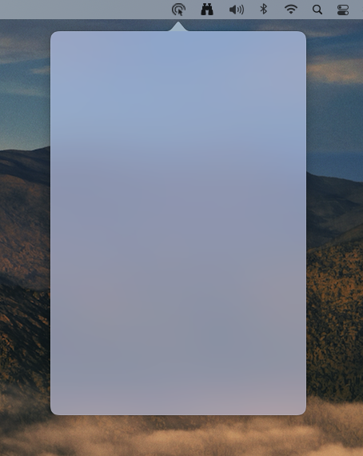
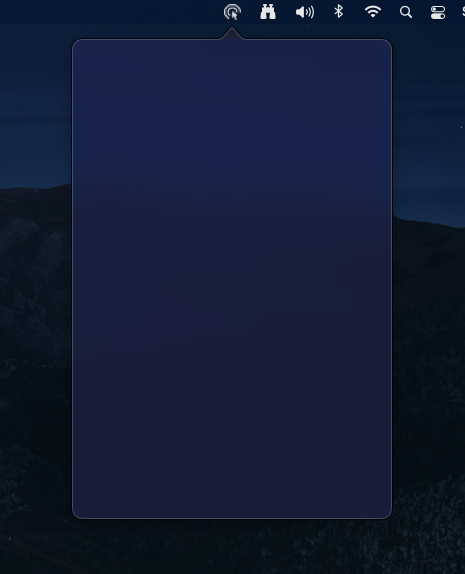

# CatalystStatusItemPopoverExample
Example Catalyst app that is shown in a UIKit popover underneath an NSStatusItem.

### References
- [How to use macOS Specific API in macCatalyst Apps(and Vice Versa)](https://medium.com/geekculture/use-of-macos-specific-api-in-maccatalyst-apps-and-vice-versa-e7082a007b7c)
- [Steve Troughton-Smith examples](https://twitter.com/stroughtonsmith/status/1458855273372782596?s=20)

### Screenshots

